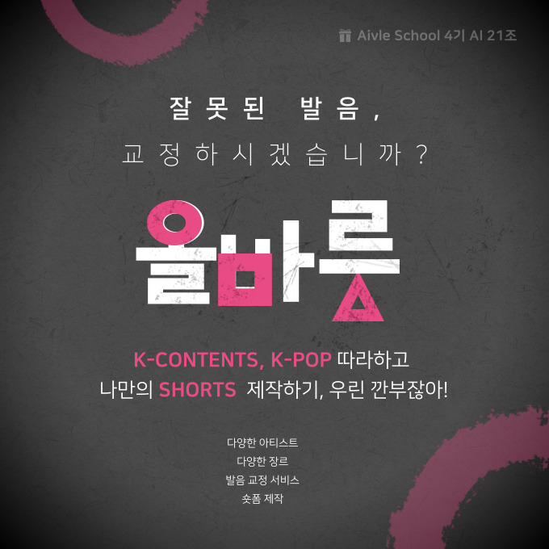

# Aivle 4기 21조 빅프로젝트 "바름" Frontend 파트

   
  
   

 

## 프로젝트 소개

AivleSchool 4기 충남/충북 7반 21조 빅프로젝트

 

## 기술 스택

 

## 사용 방법

### 1. Node.js 설치

### 2. package 설치
    npm install

### 3. dev 서버 실행
    npm run dev 

### 프론트엔드 기능 공통
- [X] Provider 상태관리
- [X] Vercel Speed Insights

### 회원가입 및 로그인
- [X] 로그인 (JWT) 
- [X] 회원가입 
- [X] Google Recaptcha V2

### 공지 게시판 및 댓글
- [X] 게시판 CRUD 
- [X] 댓글 CRUD

### 음성녹음파일 업로드 및 AI 평가
- [X] 음성파일 업로드 
- [X] 음성파일 평가 AI 
- [X] 평가결과 저장
- [ ] AI 자동튜닝
    
### 쇼츠 게시판 및 댓글
- [X] 게시판 CRUD
- [X] 댓글 CRUD 

 

## 배운 점 & 아쉬운 점

 

## 라이센스

이 프로젝트는 Unlicense 라이선스에 따라 사용이 허가됩니다.
 이는 여러분이 이 프로젝트를 어떤 목적으로든지 제약 없이 사용할 수 있음을 의미합니다.
 자세한 내용은 [여기](http://unlicense.org)를 참조하세요.

## 사용 템플릿

이 프로그램은 [next-app-template](https://github.com/nextui-org/next-app-template)을 기반으로 개발되었습니다.
 원 템플릿은 MIT 라이선스에 따라 배포되었습니다.
 해당 라이선스와 저작권 고지는 링크에 포함되어 있습니다.
